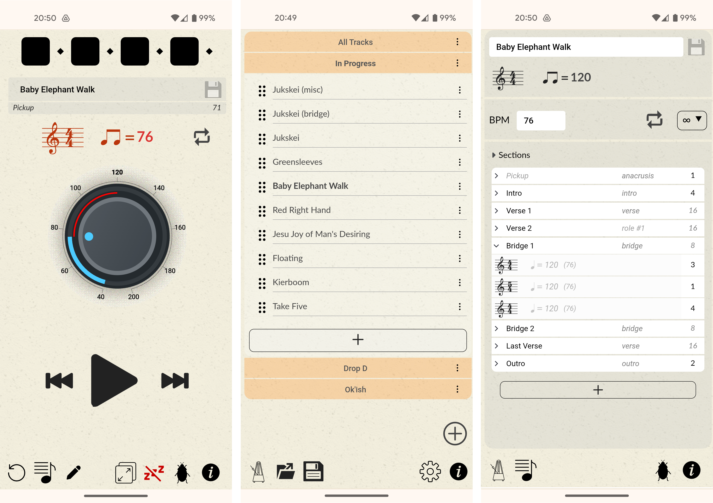

# Yet Another Metronome

**-- IN DEVELOPMENT (PRE-ALPHA) --**

Just one more _WebAudio_ metronome web app to add to the many, many other metronomes out there.

YAM is pretty much designed exclusively for use by an _almost but not entirely ham-fisted_ acoustic fingerstyle
guitarist without any appreciable musical ability who plays an old (but adored!) Taylor 310e and needs all the
help he can get. If that description is not you (it probably isn't 😄) then YMMV!

It's available online if you want to try it out:

https://yam-8sz.pages.dev

(or follow the installation instructions [below](#installation) to run your own version).


## Disclaimer

This is very much a personal project and (currently at least) developed and tested exclusively with Google Chrome on a Pixel 5a.
It will be a pleasant surprise and/or minor miracle if it works at all on anything else but you never know.


## Screenshots




## Supported browsers

| **MacOs**   | Browser    | Version        | Ok               | Notes                                      |
|-------------|------------|----------------|------------------|--------------------------------------------|
|             | Chrome     | (recent'ish)   | Yes              |                                            |
|             | Firefox    | (latest)       | Yes              | Do NOT ask about the layout hacks          |
|             | Safari     | (old)          | No               |                                            |
|             | Opera      | (latest)       | Yes              |                                            |

| **Windows** | Browser    | Version        | Ok               | Notes                                      |
|             | Chrome     |                |                  |                                            |
|             | Firefox    |                |                  |                                            |
|             | Edge       |                |                  |                                            |
|             | Opera      |                |                  |                                            |

| **Linux**   | Browser    | Version        | Ok               | Notes                                      |
|             | Chrome     |                |                  |                                            |
|             | Firefox    |                |                  |                                            |
|             | Opera      |                |                  |                                            |

| **Android** | Browser    | Version        | Ok               | Notes                                      |
|             | Chrome     | (latest)       | Yes              |                                            |
|             | Firefox    | (latest)       | Mostly           | (as above)                                 |
|             | Opera      |                |                  |                                            |
|             | Opera Mini |                | No               |                                            |

| **iOS**     | Browser    | Version        | Ok               | Notes                                      |
|             | Firefox    |                |                  |                                            |
|             | Safari     |                |                  |                                            |
|             | Opera      |                |                  |                                            |


## Installation

Download and unpack the _yam-nightly.zip_ file from the most recent [nightly](https://github.com/transcriptaze/yam/actions/workflows/nightly.yml)
build - and host the _html_ folder on a web server of your choice.

The repo includes scripts for the _Python_ and _NodeJS_ built-in HTTP servers, but the web app is entirely static so whatever
you have will probably work as long as CORS is enabled and has the following headers:
```
  Access-Control-Allow-Origin: *
  Access-Control-Allow-Methods: GET, OPTIONS
  Cross-Origin-Embedder-Policy: require-corp
  Cross-Origin-Opener-Policy: same-origin
```

### Python
To run the built-in _Python_ HTTP server:
```
python3 httpd.py
```

### NodeJS
To run the built-in _NodeJS_ HTTP server:
```
node httpd.mjs
```

## License

Everything in this repository is licensed under [GPL-3.0](https://github.com/transcriptaze/yam/blob/master/LICENSE). 


## Attributions

1. Metronome icon
   - [SVGRepo](https://www.svgrepo.com/svg/390025/metronome-tempo-beat-bpm)
   - [CC Attribution License](https://www.svgrepo.com/page/licensing)
   - Music Glyphs Icons
   - wishforge.games

2. Settings icon
   - [SVGRepo](https://www.svgrepo.com/svg/304474/settings)
   - [PD License](https://www.svgrepo.com/page/licensing)
   - Simple App Development Icons
   - Significa Labs   

3. Library icon
   - [SVGRepo](https://www.svgrepo.com/svg/506838/list)
   - [PD License](https://www.svgrepo.com/page/licensing)
   - Start Universal Tiny Oval Icons
   - Salah Elimam   

4. Song file icon
   - [SVGRepo](https://www.svgrepo.com/svg/478380/music-file-1)
   - [PD License](https://www.svgrepo.com/page/licensing)
   - Communication Icooon Mono Vectors
   - Icooon Mono

5. RIFF icon
   - [SVGRepo](https://www.svgrepo.com/svg/427846/song-music-sound)
   - [CC Attribution License](https://www.svgrepo.com/page/licensing)
   - Stylish Tiny Intertface Icons
   - Robin Kylander

6. Bravura SMUFL font
   - [Bravura](https://github.com/steinbergmedia/bravura)
   - [SIL Open Font License 1.1](https://openfontlicense.org)
   - [Steinberg](https://www.steinberg.net)

7. Lato font
   - [Lato Fonts](https://www.latofonts.com)
   - [SIL Open Font License 1.1](https://openfontlicense.org)

