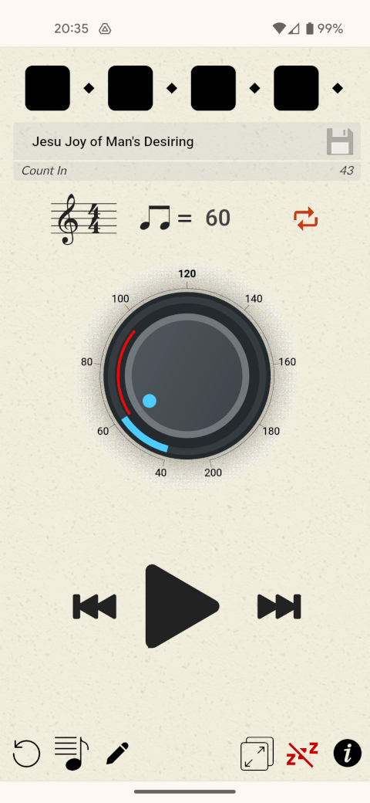

# Yet Another Metronome

**-- IN DEVELOPMENT --**

Just one more _WebAudio_ metronome web app to add to the many, many other metronomes out there.

YAM is pretty much designed exclusively for use by an _almost but not entirely_ ham-fisted acoustic fingerstyle
guitarist without any appreciable musical ability who plays an _old but adored_ Taylor 310e and needs all the
help he can get. If that description is not you (it probably isn't 😄) then YMMV!

It's available online if you want to try it out:

https://yam-8sz.pages.dev

(or follow the installation instructions [below](#installation) to run your own local version).


## Disclaimer

This is very much a personal project and (currently at least) developed and tested exclusively with Google Chrome on a Pixel 5a.
It will be a pleasant surprise and/or minor miracle if it works at all on anything else but you never know.


## Screenshots




## Supported browsers

| Platform    | Browser    | Version        | Ok     |
|-------------|------------|----------------|--------|
| **MacOs**   | Chrome     | (recent)       | Yes    |
|             | Firefox    |                |        |
|             | Safari     |                |        |
|             | Opera      |                |        |
|             | DuckDuckGo |                | **NO** |
|             |            |                |        |
| **Windows** | Chrome     |                |        |
|             | Firefox    |                |        |
|             | Edge       |                |        |
|             | Opera      |                |        |
|             | DuckDuckGo |                |        |
|             |            |                |        |
| **Linux**   | Chrome     |                |        |
|             | Firefox    |                |        |
|             | Opera      |                |        |
|             | DuckDuckGo |                |        |
|             |            |                |        |
| **Android** | Chrome     |                | Yes    |
|             | Firefox    |                |        |
|             | DuckDuckGo |                | **NO** |
|             |            |                |        |
| **iOS**     | Chrome     |                |        |
|             | Firefox    |                |        |
|             | Safari     |                |        |


## Installation

Download and unpack the _yam.zip_ file from the most recent [nightly](https://github.com/transcriptaze/yam/actions/workflows/nightly.yml) build.

It needs to be hosted by a web server - the repo includes scripts for the _Python_ and _NodeJS_ built-in HTTP servers - but the web app
is entirely static so whatever you have will probably work as long as CORS is enabled and has the following headers:
```
  Access-Control-Allow-Origin: *
  Access-Control-Allow-Methods: GET, OPTIONS
  Cross-Origin-Embedder-Policy: require-corp
  Cross-Origin-Opener-Policy: same-origin
```

### Python
```
python3 httpd.py
```

### NodeJS
```
node httpd.mjs
```

## License

Everything in this repository is licensed under [GPL-3.0](https://github.com/transcriptaze/yam/blob/master/LICENSE). 


## Attributions

1. Metronome icon
   - https://www.svgrepo.com/svg/390025/metronome-tempo-beat-bpm
   - Music Glyphs Icons
   - CC Attribution License
   - wishforge.games

2. Settings icon
   - https://www.svgrepo.com/svg/304474/settings
   - Simple App Development Icons
   - PD License
   - Significa Labs   

3. Library icon
   - https://www.svgrepo.com/svg/506838/list
   - Start Universal Tiny Oval Icons
   - PD License
   - Salah Elimam   

4. Song file icon
   - https://www.svgrepo.com/svg/478380/music-file-1
   - Communication Icooon Mono Vectors
   - PD License
   - Icooon Mono

5. RIFF icon
   - https://www.svgrepo.com/svg/427846/song-music-sound
   - Stylish Tiny Intertface Icons
   - CC Attribution License
   - Robin Kylander

6. Bravura SMUFL font
   - [Bravura](https://github.com/steinbergmedia/bravura)
   - [SIL Open Font License 1.1](https://openfontlicense.org)
   - [Steinberg](https://www.steinberg.net)

7. Lato font
   - [Lato Fonts](https://www.latofonts.com)
   - [SIL Open Font License 1.1](https://openfontlicense.org)
